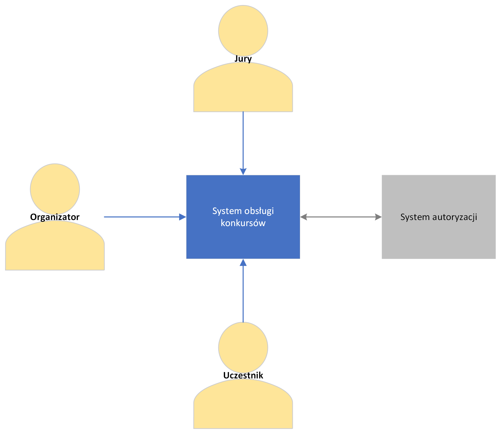
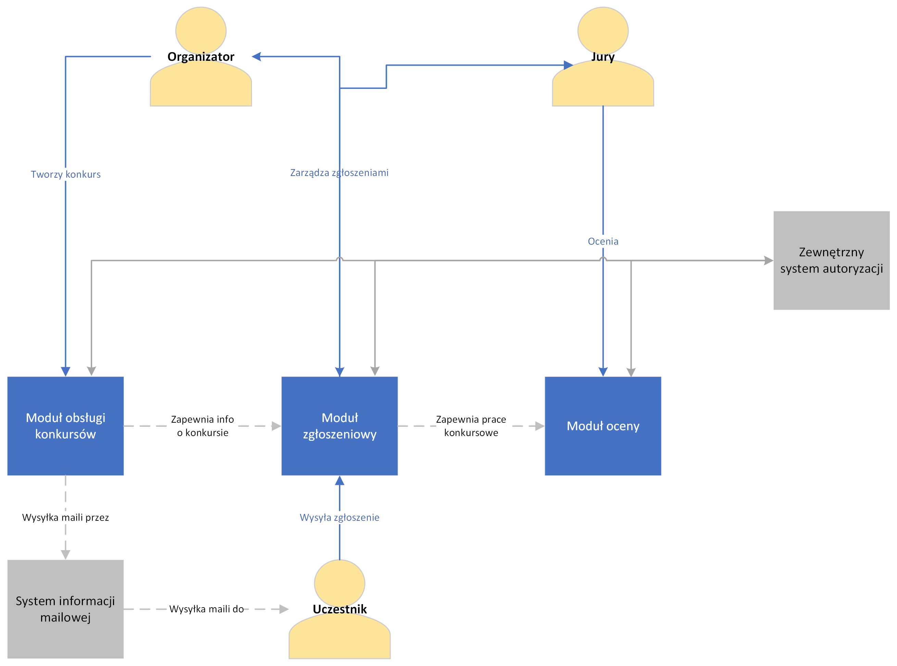
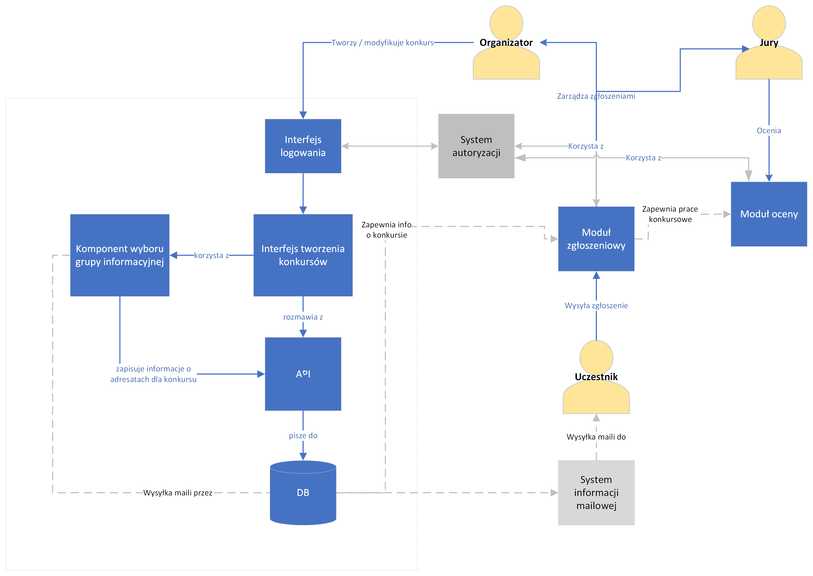
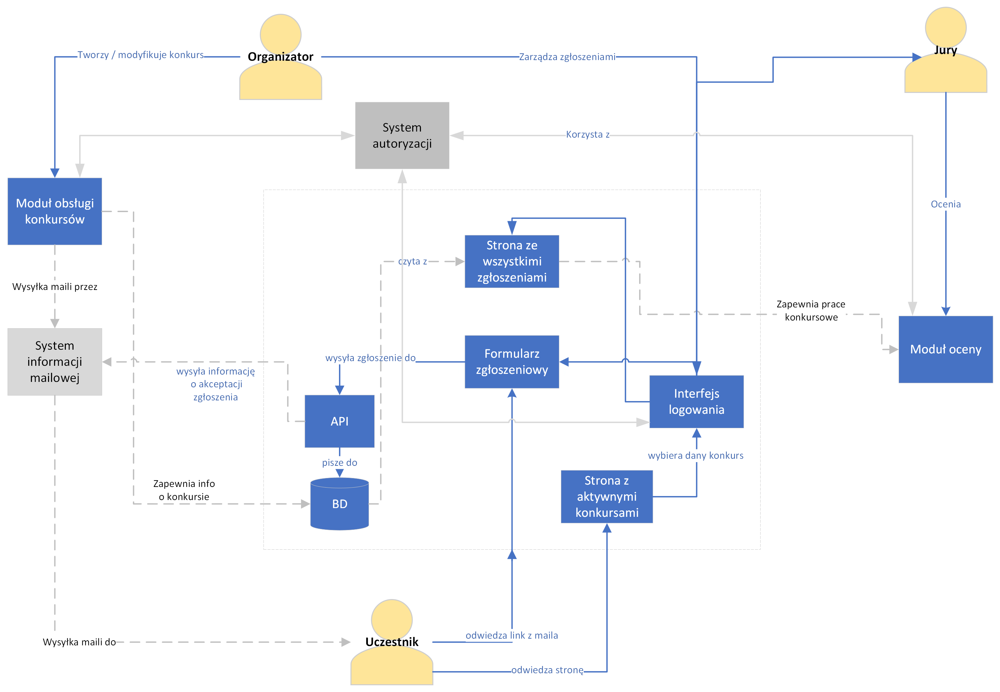
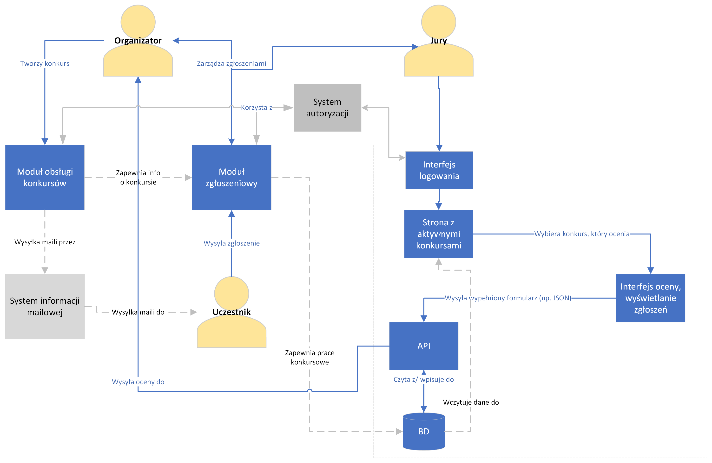
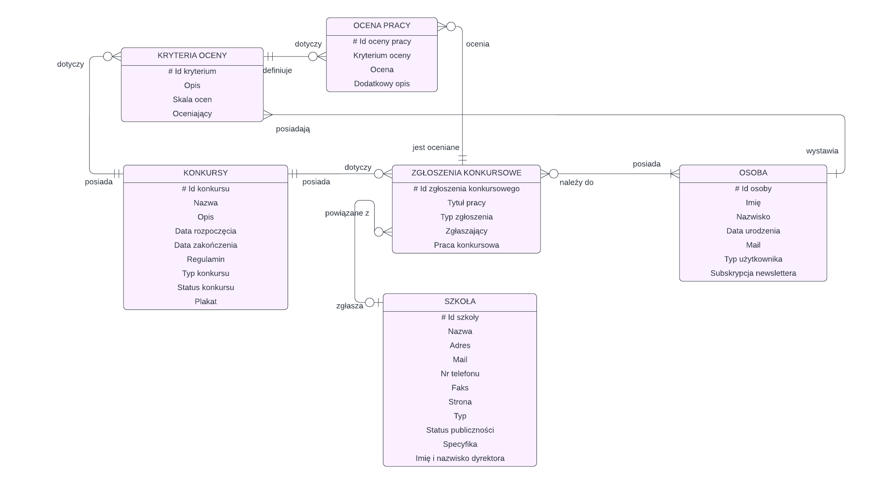

Architektura
============

**Model C4**
Model C4 pozwala na wizualizację architektury na wielu poziomach abstrakcji projektu, ułatwiając pracę nad nim, co jest bardzo pomocne. W związku z tym postanowiliśmy oprzeć projektowanie architektury na właśnie tej metodyce.

**Model ER bazy danych**

**Model logiczny bazy danych**

.. image:: _static/Logical_model.png
   :alt: Model logiczny